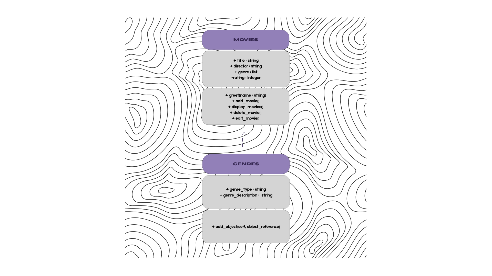
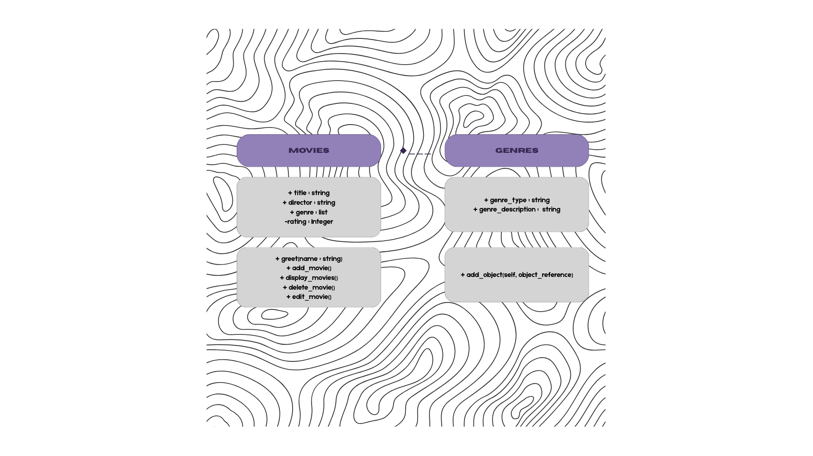
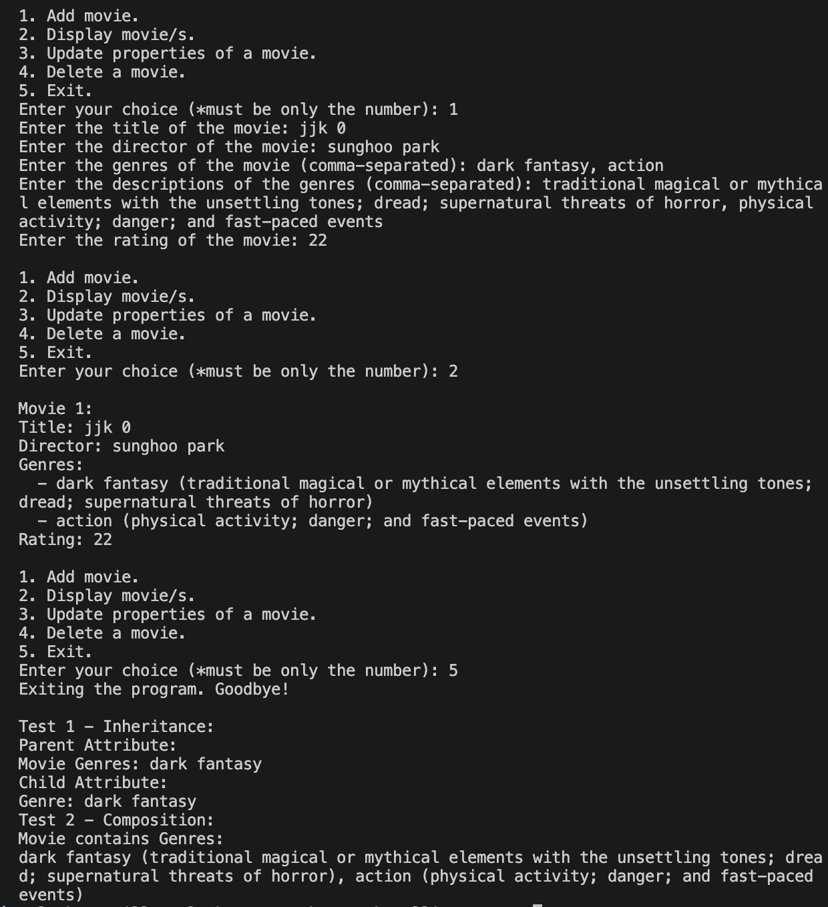

# Advanced Class Relationships
## Previous Activities
[classAttrib](classAttributesMethod.md)
[classRel](classRelationships.md)
## Existing System Description:
## Inheritance Relationship
Parent:
Child:
Explanation:
## Inheritance UML

## Composition/Aggregation
Relationship:
Diagram:
## Advanced UML Diagram

## Python Implementation
[Source Code](advancedRelationships.py)
## Test Run

## Object Diagram

## Reflections:
Answers:
