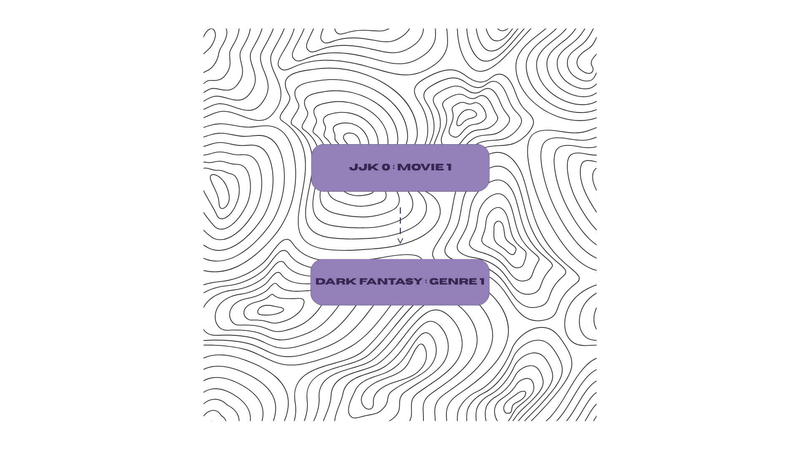

 # Advanced Class Relationships
## Previous Activities
[classAttrib](classAttributesMethod.md)
[classRel](classRelationships.md)
## Existing System Description: Movie HAS-A genre
## Inheritance Relationship
Parent: Movie
Child: Genre
Explanation: The child class is an attribute or property of the parent class, because a movie contains genre/s.
## Inheritance UML

## Composition/Aggregation
Relationship: Composition: Strong HAS-A relationship
Explanation: The child class (genres) is an attribute of the parent class (movie), meaning if the parent class was to be deleted, so is the child class because it is under that.
## Advanced UML Diagram

## Python Implementation
[Source Code](advancedRelationships.py)
## Test Run

## Object Diagram

## Reflections:
1. Why did you choose your inheritance relationship? Explain why your child class is a type of your
parent class.
Answer: The child class (genres) is a category of the parent class (movie). It allows identification of each object under the first/parent class. The inheritance relationship allows easier and more efficient passing on of properties and methods.
2. How did inheritance reduce duplicate code? Identify attributes or methods that were reused.
Answer: The inheritance relationships allows the multiple use of a single code with similar functions for each object. It reduces the similar methods to appear multiple times. The same attributes of the two classes include the genre names and descriptions, and the similar methods include the addition, editing, and deleting of these aforementioned attributes.
3. Why is your HAS-A relationship Composition or Aggregation? Explain the lifecycle relationship
between the two objects.
Answer: The relationship I chose between the two classes (movie and genre/s) is composition. Composition shows a strong has-a relationship. It fits the class relationships because the child class is a property of the parent class. Without the parent class, the child class will not exist.
4. What is the difference between Association from Part III and the advanced relationship you
implemented?
Answer: Association relationship allows the two classes to connect or be linked with each other. While, the composition relationship lets the two classes be dependent on each other because their existence is connected. Association allows the shared attributes and methods between the two but the properties can be altered separately; meanwhile, the composition allows the attributes and methods be completely shared, dependent, and same for each other.
5. How does your design follow the DRY principle?
Answer: The "don't repeat yourself" or DRY principle is a concept that highlights the efficiency of using a single representation. My design of a movie inventory uses this through several functions, named and inherited variables, and repeatedly used methods. The principle is evident from the repeated use of the functions, methods, and properties.
