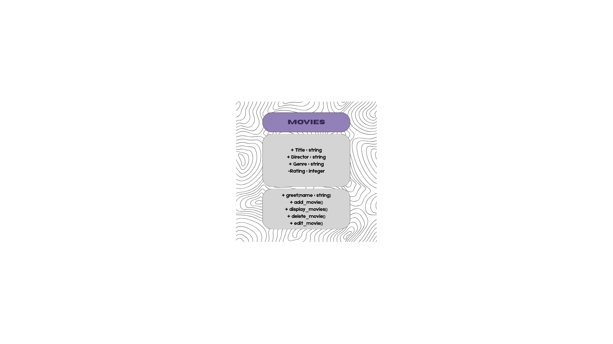
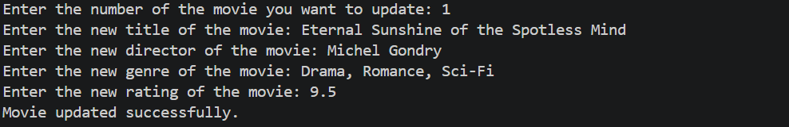
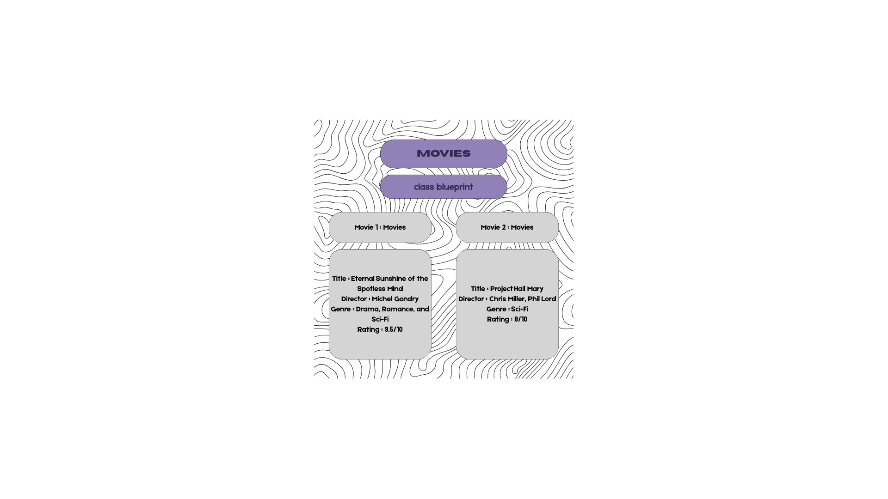

# Class Attributes and Methods
## Previous Design
Link to my previous activity:
[classObjectUML.md](classObjectUML.md)
## Design Revision
Changes from my previous design:
1. Add greet(name) function.
2. Replace add() with add_movie().
3. Replace display() with display_movies().
4. Replace edit() with update_movie().
5. Replace remove() with delete_movie().
## Visibility Decisions
| Attribute | Data Type | Visibility | Reason |
|---|---|---|---|
| Title | String | Public | The title names the object and identifies it from the rest. |
| Director | String | Public | This is an important information about the object. |
| Genre | String | Public | The genre will display its category among all. |
| Rating | Integer | Public | The rating is still important to display but is also needed to be protected as the value is a personal answer. |
## Updated UML Class Diagram

## Python Implementation
[View Python Source](classImplementation.py)
## Test Run

## Object Diagram

## Analysis
### Why did you make your chosen attribute private?
#### The chosen attribute which is the rating is a value derived from a personal opinion which means it should not be changed or edited outside the class.
### Which method changes the state of your object?
#### I used the update_movie() method which allowed me to change 2 properties in the object (genre and rating).
### How did your two objects demonstrate that instances are independent?
#### When the first object was changed, it did not affect the properties of the other object, showing that the 2 objects have independent properties even if those were derived from the same functions.
### What is the difference between your class diagram and your object diagram?
#### The class diagram shows the format of the blueprint; meanwhile, the object diagram presents how the class acts as a blueprint. The former shows the properties and methods, and the latter one presented the specific values derived from the methods.
