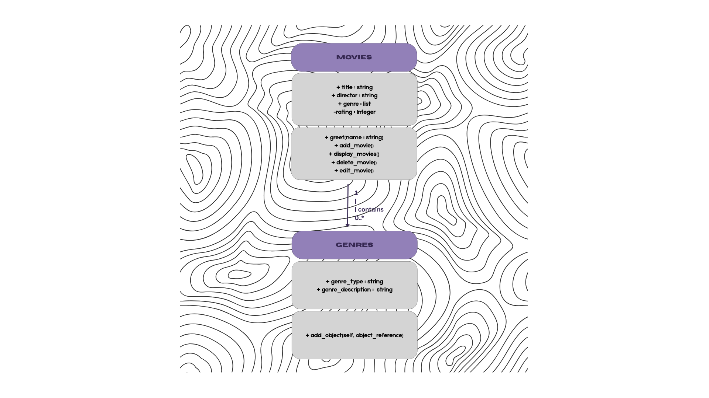
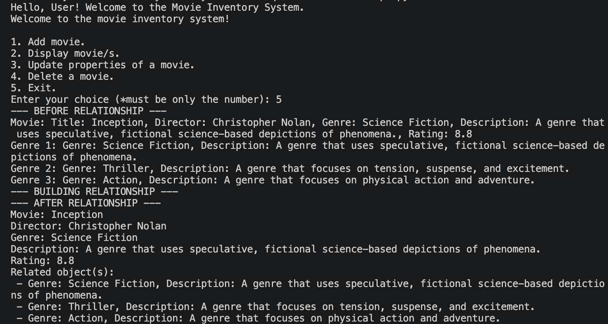
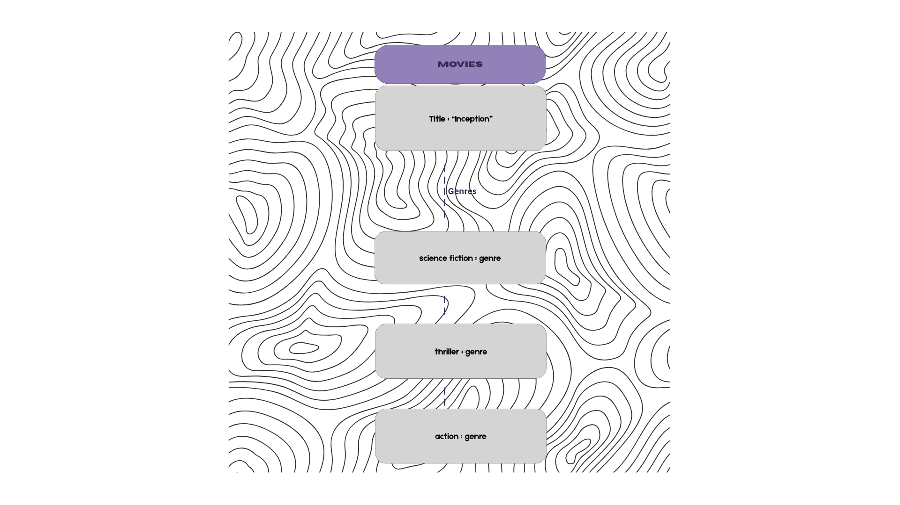

# Class Relationships: Association and Multiplicity
## Previous Work
[Part I - Classes and Objects](classObjectUML.md)
[Part II - Class Attributes and Methods](classAttributesMethods.md)
## Existing Class
### Class: Movies
### Description: This class is an inventory of different movies.
## New Related Class
### Class: Genres
### Description: This class classifies the movies from the first class into their respective genres.
## Association
### Relationship: Movie HAS-A Genre
### Explanation: Movie contains genres. From the first class, the object already has a property for genres. In this class, that property will be used as a classification of these movies.
## Multiplicity

### Multiplicity: 1 : many
### Explanation: The multiplicity of this relationship is one-to-many. It allows a single object to be identified under several categories which is the genres, as a single movie can have several genres. 
## UML Class Relationship Diagram

## Python Implementation
[View Python Source](classRelationships.py)
## Test Run

## Object Relationship Diagram

## Analysis
### What is the association between your two classes?
#### The first class (movies) contains the second class (genres). The second class can serve as a classification of the first class.
### What multiplicity did you choose and why?
#### The best to use is the one-to-many relationship as the first class (movie) may contain several of the second class (genres).
### How did you implement the relationship in Python?
#### I created a new (the second) class and a list which is under the first class to link the two.  
### Why did you store an object reference instead of copying its data?
#### The use of object reference is preferred than copying data for better performance. This allows the use of stored data than a duplicated one. 
### If your relationship uses many, why is a list appropriate?
#### A list is essential as it lets multiple values be stored under one, which greatly helps in data organization when it is called or used in different functions.
